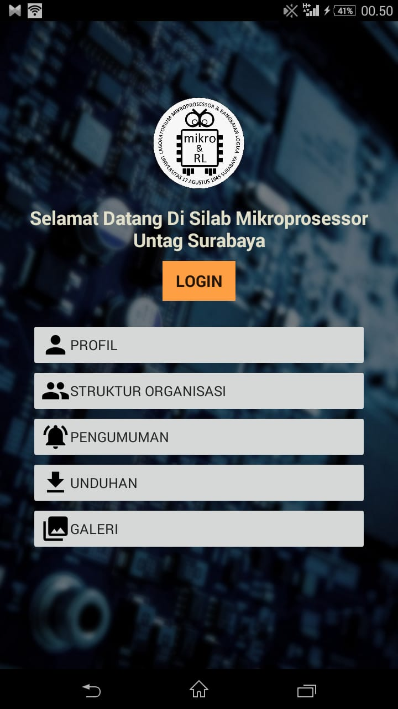
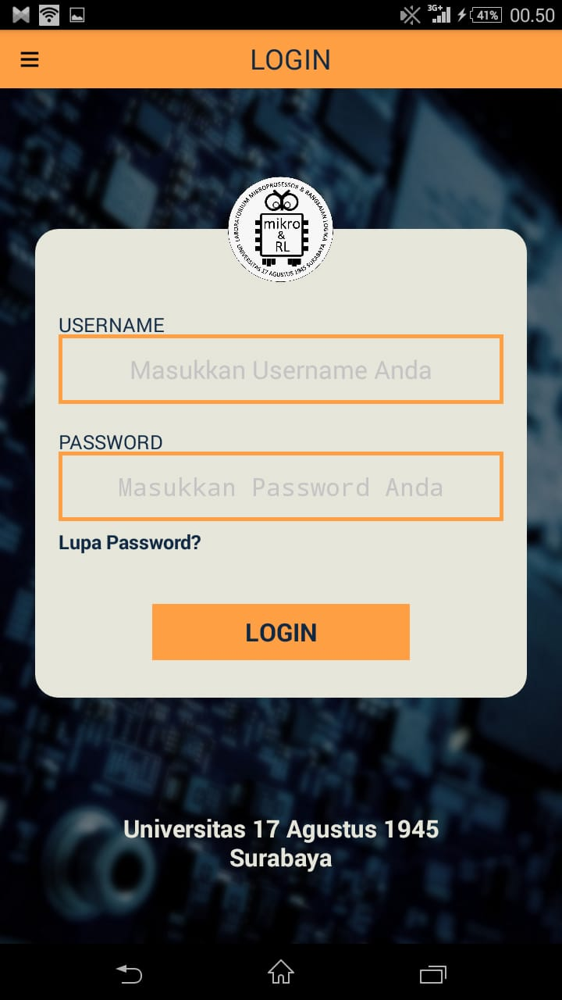
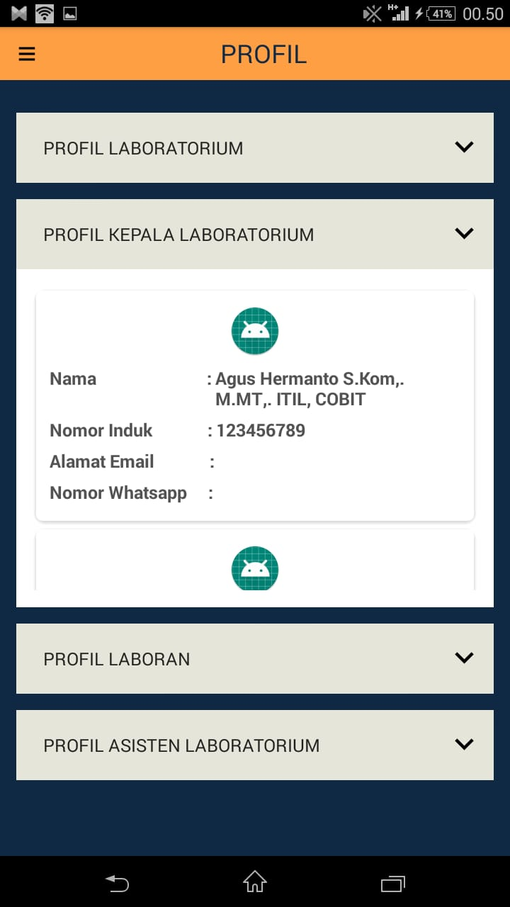
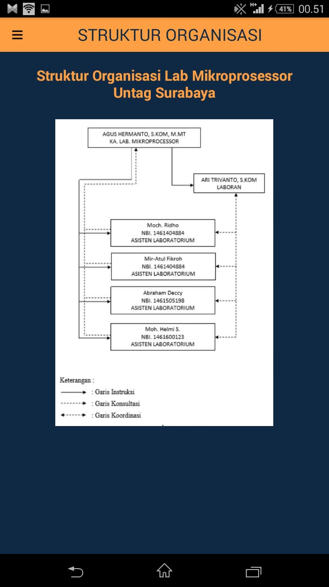
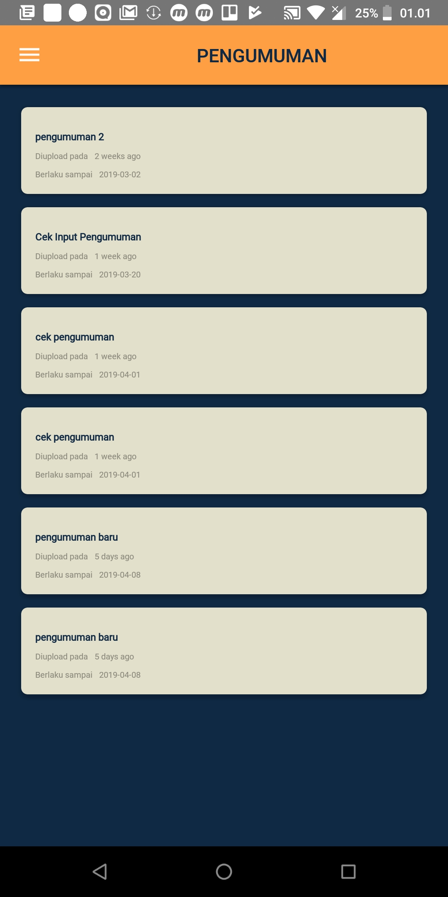
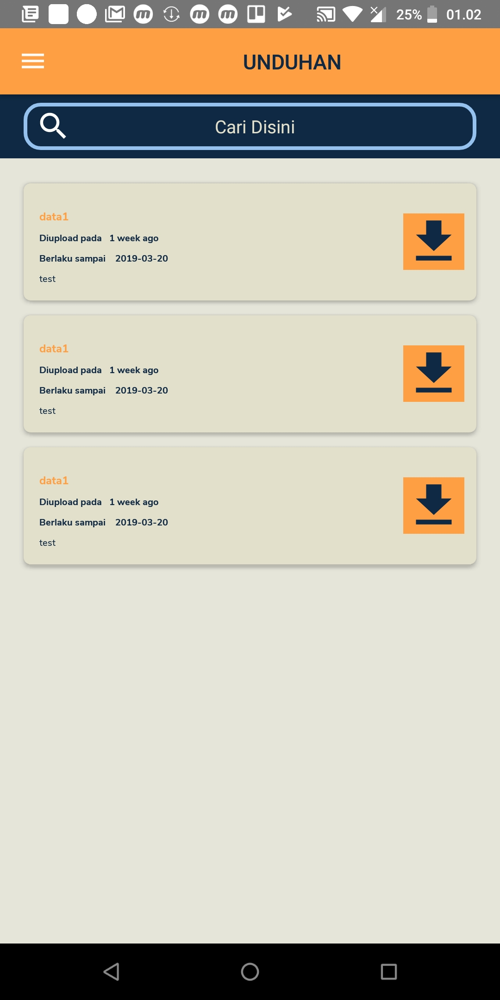
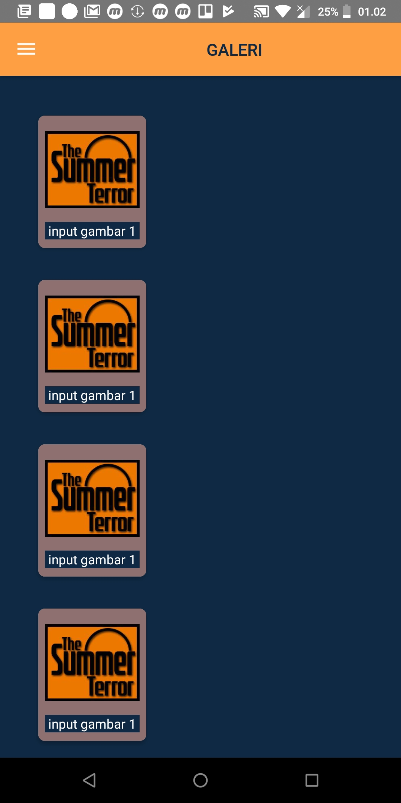

# Information System of Laboratory of Microprosessor Untag Surabaya

  

|Task Name|Description|
|:---|:---|
|`Tables Release`|1.0 |
|`Document Status`|DRAFT |
|`Document Owner`|Nurul Fadhilah|
|`Mockup Designer`|Nurul Fadhilah|
|`Layout Designer`|[Resha Pratama Nugroho](https://web.facebook.com/reshapratama.nugroho)|
|`Developer`|Nurul Fadhilah & [Resha Pratama Nugroho](https://web.facebook.com/reshapratama.nugroho)| 

  
# Background

We all know Android app now is on the rise. Nowadays almost everyone already uses a smartphone to help each of its activities. 
No exception to get an information, they just turn the smartphone on and open an app that they want. Therefore we make an information system android platform that aims to make it easy for everyone in University of 17 Agustus 1945 environment, especially for lecturers supervisor, head of laboratory, laboratory officers, laboratory assistant, and students to make it easier to manage things relating to the activities of the laboratory course. So this is something we need to have.

# Requirements
|No.|User Story Title|User Story Description|Priority|Notes|
|:---|:---|:---|:---|:---|
|`1`|Registered Account|
The participant is active as a student majoring in informatic engineering and signed up at the associated lab course
|Must have|The registered account can be either Email addresses or number Whatsapp|
|`2`|Email Integration|
When user forget the password for login, they can receive new pass via Email.
|Optional|User need to input the correct Email address in app|
|`3`|Whatsapp Integration|
When user forget the password for login, they can receive new pass via Whatsapp.
|Optional|User need to input the correct number of Whatsapp in app|
|`4`|API|
A developer wants to integrate with the mobile app so that they can embed the activity stream on their website
|Should have|<ul><li>We should contact to our team as we did something similar</li></ul>

# User Interaction and Design
|No|Name|Image Mockup|Description|
|:---:|:---:|:---:|:---:|
|`1`|Home Screen||
Initial display after splashscreen. There is a menu option such as Login, Profile, Announcements, Downloads, and a Gallery.
|
|`2`|Login Screen||
The user must enter a username and password to login to the next page. When user forget the password, then the user will be connected to a different page
|
|`3`|Profil Screen||
Contains the information of laboratory and each officer profile laboratories. Such as head of the laboratory, Laboratory Assistant, Laboran.
|
|`4`|StrukturOrg Screen||
Showing organizational structure of Laboratory of Microprosessor Untag Surabaya
|
|`5`|Pengumuman Screen||
Contains RecyclerView that contains the information about announcement. Laboratory Officer (Head of the laboratory and Lab assistant) who made the announcement and then upload it on the system
|
|`6`|Unduhan Screen||
Contains RecyclerView that contains information about the downloadable things (such as practical task, schedule of implementing the practical, schedule of practical exam) by users of the application, specifically for student
|
|`7`|Galeri Screen||
Gallery containing photos of the ongoing practical activities and user can enjoy the pictures more clearly by clicking one of the photo, and then will appear a pop-up that displays the photo becomes larger.
|
